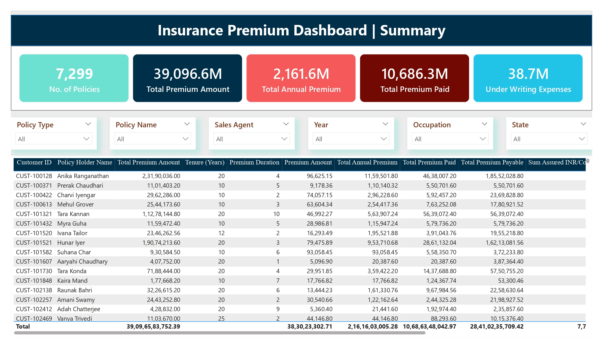
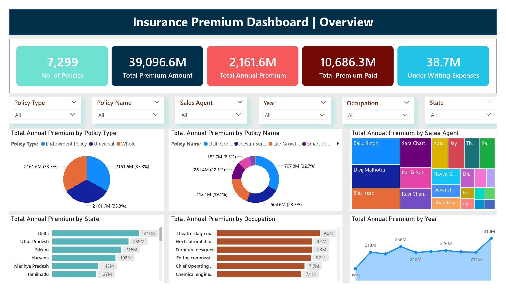
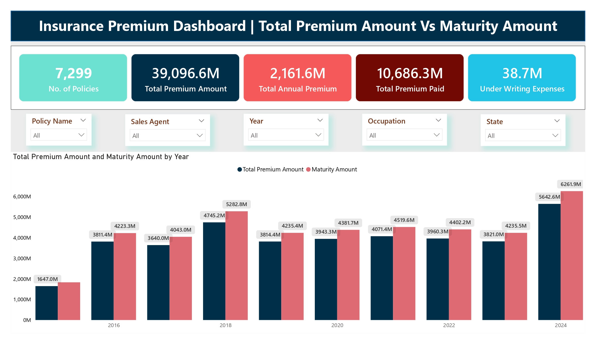
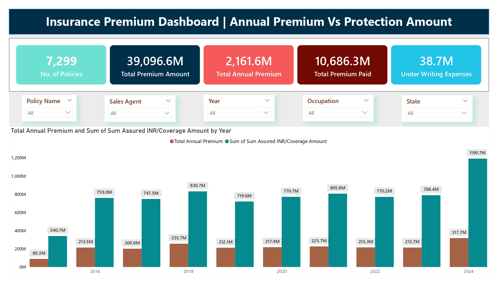
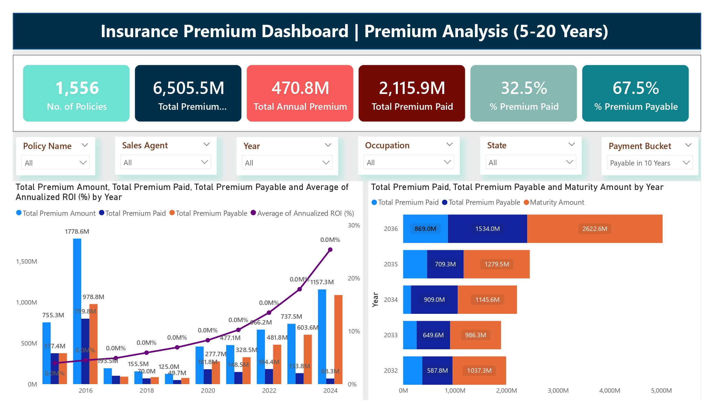

# 🛡️ Insurance Premium & Policy Insights Dashboard

> **Power BI | DAX | Data Modeling | Insurance Domain**

---

## 📌 SITUATION

The insurance domain generates massive volumes of policy and premium data across multiple policy types (Endowment, Universal, and Whole Life), sales agents, geographies, and customer segments.

**Business Problem:**
- There was no centralized view for stakeholders to monitor **premium collection**, **policy maturity timelines**, and **sales performance** across regions and agents.
- Decision-makers had no visibility into how much premium had been collected vs. how much was still payable, and whether the **maturity amounts justified the premiums** being charged.
- With **7,299 Active policies** and **₹39,096.6M in total premium**, tracking this manually or in spreadsheets was inefficient and error-prone.

---

## 📌 TASK

My responsibility was to **design and build an end-to-end Power BI dashboard** that would:

1. Provide a **summary view** of all key KPIs in one place
2. Break down **annual premium** by policy type, policy name, state, occupation, year, and sales agent
3. Enable **premium vs. maturity amount comparison** year-over-year
4. Perform **premium analysis** for 5–20 year policy buckets — tracking what has been paid vs. what is still owed
5. Present a **sales hierarchy** view (Zonal Manager → Regional Manager → Policy Holder) for team performance tracking

---

## 📌 ACTION

### 🔧 Data Preparation & Modeling
- Cleaned and structured raw insurance policy data with fields including Customer ID, Policy Name, Tenure, Premium Duration, Premium Amount, Sum Assured, and Maturity Amount
- Built relationships across policy, customer, sales agent, and geography dimension tables
- Created a **date table** to enable year-level trend analysis across 2016–2024

### 📐 DAX Measures Created
- `Total Premium Amount` — total contractual value across all policies
- `Total Annual Premium` — annualized premium obligation per policy
- `Total Premium Paid` — cumulative amount collected to date
- `Total Premium Payable` — outstanding balance remaining
- `% Premium Paid` and `% Premium Payable` — collection efficiency metrics
- `Maturity Amount` — projected payout on policy maturity
- `Annualized ROI (%)` — return on investment from the customer's policy perspective
- `Under Writing Expenses` — cost tracking for policy issuance

### 📊 Dashboard Pages Built

| Page | Purpose |
|------|---------|
| **Summary** | Top-level KPIs + customer-level policy detail table |
| **Overview** | Sliced annual premium by policy type, name, state, occupation, agent, and year |
| **Total Premium vs. Maturity Amount** | Year-over-year bar chart comparison (2016–2024) |
| **Annual Premium vs. Protection Amount** | Annual premium vs. Sum Assured coverage by year |
| **Premium Analysis (5–20 Years)** | Payment bucket analysis with future maturity timeline (2032–2036) |
| **Sales Hierarchy** | Drill-down matrix: Zonal Manager → Regional Manager → Policy Holder |

#### 📸 Page 1 — Summary

#### 📸 Page 2 — Overview

#### 📸 Page 3 — Total Premium Amount Vs Maturity Amount

#### 📸 Page 4 — Annual Premium Vs Protection Amount

#### 📸 Page 5 — Premium Analysis (5–20 Years)

#### 📸 Page 6 — Sales Hierarchy

### 🎛️ Interactivity & Filters
- Slicers for: **Policy Type, Policy Name, Sales Agent, Year, State, Occupation, Payment Bucket**
- Tenure Date range slider for filtering active policy windows
- Drill-down matrix in the Sales Hierarchy page allowing expansion by Gender, State, and Policy Holder

---

## 📌 RESULT

| Metric | Value |
|--------|-------|
| Total Policies Tracked | **7,299** |
| Total Premium Amount | **₹39,096.6M** |
| Total Annual Premium | **₹2,161.6M** |
| Total Premium Paid | **₹10,686.3M** |
| Under Writing Expenses | **₹38.7M** |
| Premium Collection Rate (5–20 Yr Bucket) | **32.5% paid, 67.5% payable** |

**Business Impact:**
- Stakeholders could now instantly identify **top-performing states** (Delhi: ₹271M, Uttar Pradesh: ₹239M) and **high-value policy segments** (ULIP Growth: ₹707.8M — 32.7% of annual premium)
- The **maturity vs. premium chart** revealed that maturity amounts consistently exceeded total premium amounts, validating product value proposition for customers
- The **Sales Hierarchy page** enabled managers to drill from Zonal → Regional → individual policyholder performance in a single view
- The **Premium Analysis page** projected future cash flows through 2036, helping finance teams plan liquidity requirements

---

## 🗂️ Key Visuals at a Glance

- **KPI Cards** — No. of Policies, Total Premium Amount, Total Annual Premium, Total Premium Paid, Under Writing Expenses
- **Donut Chart** — Annual Premium by Policy Type (equal 33.3% split across Endowment, Universal, Whole)
- **Donut Chart** — Annual Premium by Policy Name (ULIP Growth leads at 32.7%)
- **Treemap** — Sales Agent performance comparison
- **Bar Charts** — State-wise and Occupation-wise annual premium breakdown
- **Line + Bar Combo Chart** — Premium Amount vs. Maturity Amount by Year (2016–2024)
- **Clustered Bar Chart** — Annual Premium vs. Sum Assured coverage by year
- **Drill-down Matrix** — Full sales hierarchy with financial metrics per node

---

## 🛠️ Tools & Skills Used

`Power BI Desktop` · `DAX` · `Data Modeling` · `Power Query` · `Insurance Domain Knowledge`

---
